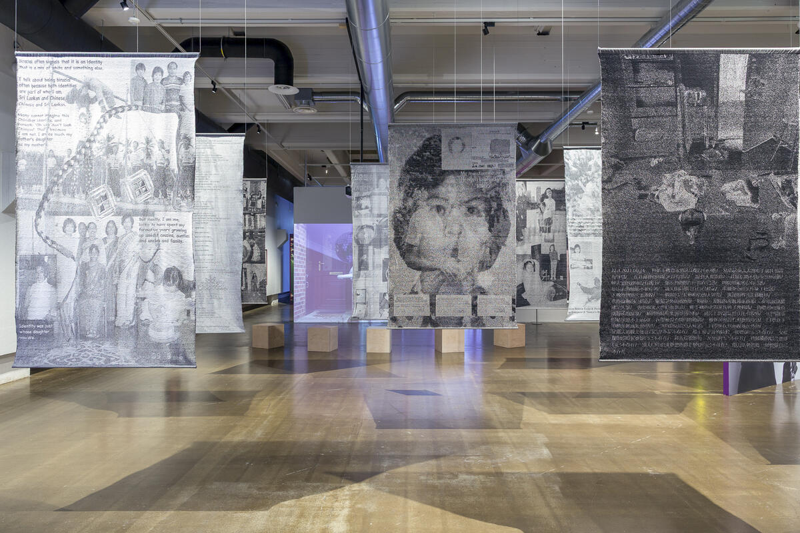

### **Save as Text**

   
2025     
Jacquard Weave, Handwoven, Wool and Cotton. Designed and woven by Yujie Zhou.

***An Oriental Girl*** critically examines the politics of representation and systemic racialization through the lens of the Asian diaspora in Finland. The title is a reference to a caption attached to a studio portrait that belongs to the Finnish Museum of Photography’s collection. The image was donated to the museum in 1987 and had originally been labeled as *“Portrait of an oriental girl”* in the museum’s archival database. This reflects a broader pattern of framing BIPOC individuals through a White-centric lens, as it flattens the identity and erases the subjectivity of the person being depicted.

During Yujie Zhou’s research into the museum’s archives, Zhou encountered a striking absence of representations of the Asian diaspora in Finland. Visual materials originating from within Asian communities were virtually nonexistent. This glaring lack in the collection of an institution’s archive tasked with, among other things, preserving the stories that make up the cultural heritage of Finland. This archival void prompted the development of a counter-institutional framework: the Asian Diaspora Archive—a collaborative initiative to collect and create visual and textual materials with, by, and for the Asian diaspora community living in the country. 

At the core of this newly commissioned project are handwoven Jacquard tapestries developed through conversations with participants of Asian heritage, including first-generation immigrants and Finnish-born individuals. Personal photographs and archival fragments are transformed into woven tapestries that function both as intimate monuments and collective acts of resistance. These works interrogate how memory, identity, and racialized visibility are encoded in visual and institutional languages. With *An Oriental Girl* Zhou reveals how the archive functions as a way to generate, reaffirm and regenerate the stories that we tell. As philosopher Achille Mbembe puts it:
*The final destination of the archive is therefore always situated outside its own materiality, in the story that it makes possible.*

Yujie Zhou is indebted to the generous time, energy, and resources of collaborators Miia Laine, Chih-Tung Lin, Yilin Ma, Tania Nathan, Hai Nguyen, Susi Siriya Orenius, Marika Peura, Vishnu Vardhani Rajan, and Yu-Hsuan Yao. This work would not be made possible without their ongoing conversations and support.

“The portrait of an oriental girl” in the Finnish Museum of Photography’s collection is a work by the photographer **Salme Simanainen** (1920-2012), whose studio in Helsinki was appreciated by celebrities, among others. The names of the portrayed people from Simanainen’s studio are not all written on the prints, but behind the “oriental girl” print, she had written: “A Japanese pianist in Helsinki”.

***An Oriental Girl ***, Installation View at *Invisible Race*, **Finnish Museum of Photography**, Helsinki, Finland, September 2025-March 2026.    

Image Credit: Invisible Race exhibition, Finnish Museum of Photography, photographer Virve Laustela, 2025

&nbsp;

