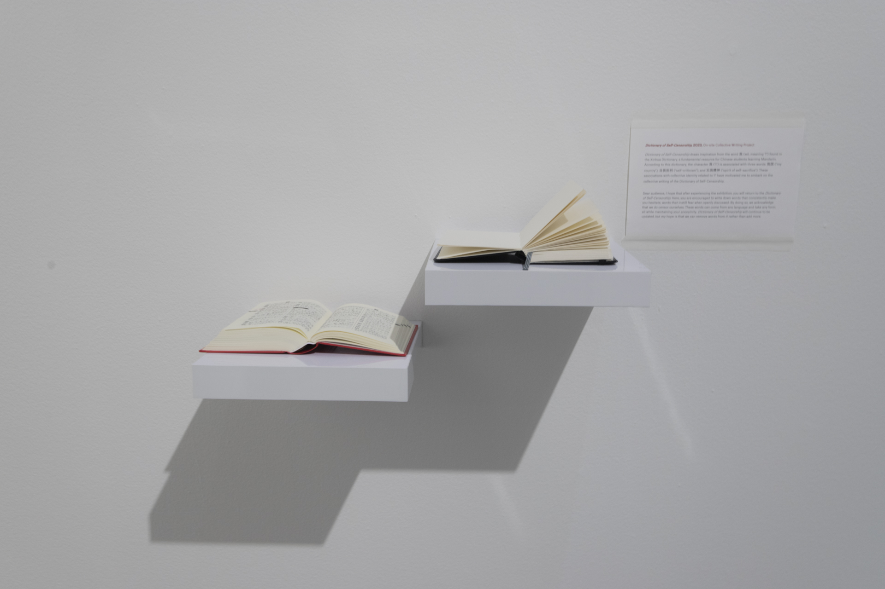
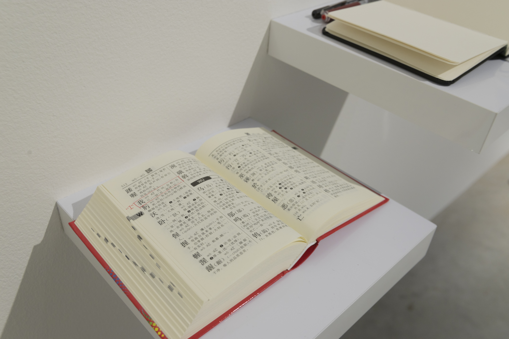

### **Dictionary of Self-Censorship **
from the series *Panoptic Segmentation*     
2023, On-site Collective Writing Project.

*Dictionary of Self-Censorship* draws inspiration from the word 我 (wǒ, meaning 'I') found in the Xinhua Dictionary, a fundamental resource for Chinese students learning Mandarin. According to this dictionary, the character 我 ('I') is associated with three words: 我国 ('my country'), 自我批判 ('self-criticism'), and 忘我精神 ('spirit of self-sacrifice'). These associations with collective identity related to 'I' have motivated me to embark on the collective writing of the Dictionary of Self-Censorship.

"Dear audience, I hope that after experiencing the exhibition, you will return to the *Dictionary of Self-Censorship*. Here, you are encouraged to write down words that consistently make you hesitate, words that instill fear when openly discussed. By doing so, we acknowledge that we do censor ourselves. These words can come from any language and take any form, all while maintaining your anonymity. *Dictionary of Self-Censorship* will continue to be updated, but my hope is that we can remove words from it rather than add more."

 

 
  
***Dictionary of Self-Censorship***, Installation View at *QWERTY*, Solo Exhibition at **Photographic Gallery Hippolyte**, Finland, 2023

  
