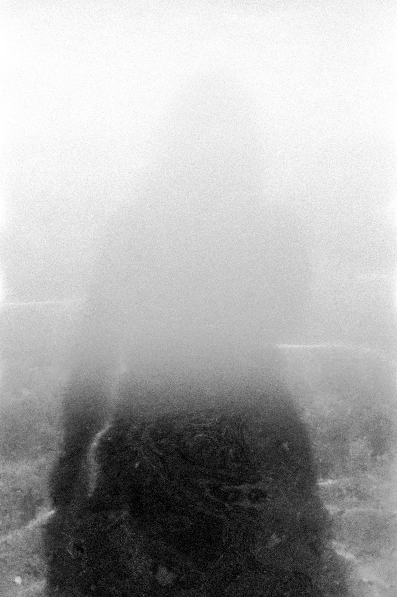

### **Eclipse**

from the series *Panoptic Segmentation*  
2022, Archival pigment print, 120 x 80 cm    

Photography in Chinese essentially means 'capturing shadows,' while the Latin etymology of photography refers to 'drawing with light.' Photography provides me with the lens through which to explore the contents of capturing shadows—to discern what is still visible, even within the darkness they cast.

  
***Eclipse***, 2022

&nbsp;

  
***Eclipse***, Installation View at *MoA 23*, **Finnish Museum of Photography**, Finland, 2023

&nbsp;

  

  
***Eclipse***, Installation View at *QWERTY*, Solo Exhibition at **Photographic Gallery Hippolyte**, Finland, 2023      
image credit: Milla Talassalo / Hippolyte
