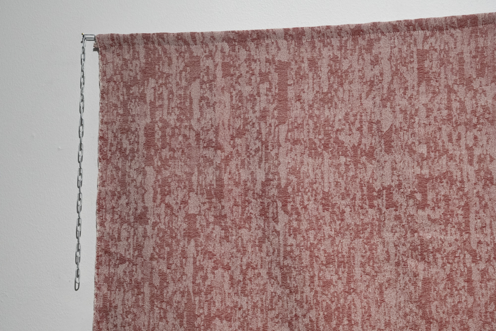
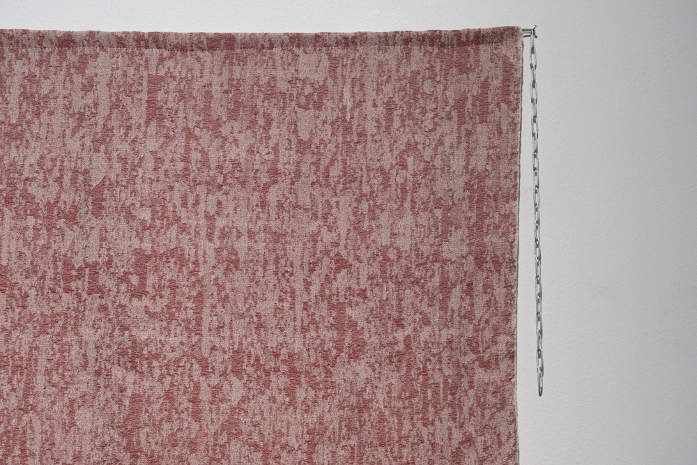
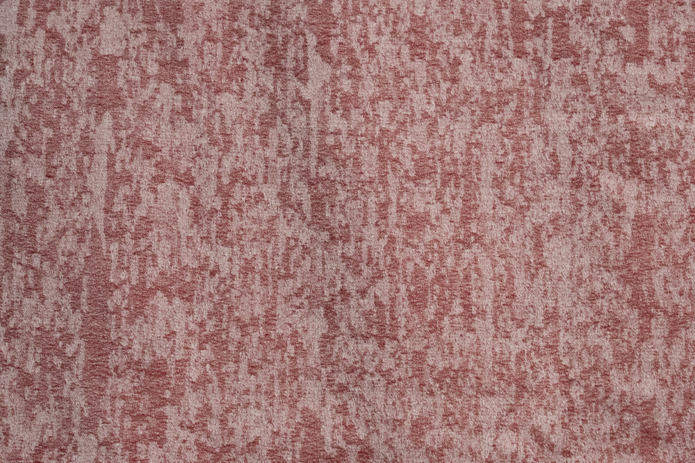

### **Making Myself Invisibel**

from the series *Panoptic Segmentation*      
2023, 105 x 105 cm, Jacquard Weave, Handwoven, Wool and Cotton. 

Making Myself Invisible was triggered by an incident, I was scanning myself using a 3D scanner and instead of exporting the file as an .obj 3D object format –as I should have– I exported it as a .png image. A three-dimensional me got then transformed into a fragmented two-dimensional self, an image where only fragments of my skin remained visible. To my eyes, these woven fragments of myself act as shields, are tokens of protection, and become armor aiding me in avoiding detection.

   

   

   

   