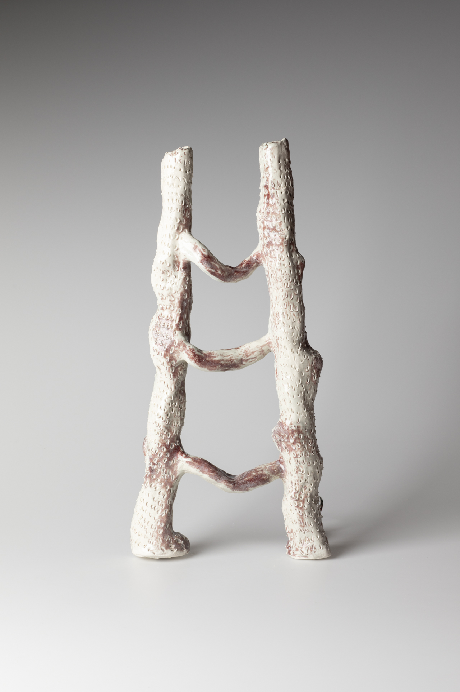

### **Ladder and Wall**

from the series *Panoptic Segmentation*      
2022, Ceramics, 65 x 45 x15 cm

In *Ladder and Wall*, I purposefully trigger a fissure as to pierce the Great Firewall, climbing up the ladder by means of a VPN (Virtual Private Network). Moved by the strengthened censorship that, following the COVID-19 breakout, took over all content shared in social media platforms, this is, back in Spring 2020, I found myself creating a folder titled Censorship in my Google Drive account. There, I backed up a series of screenshots I had been taking, in an urge to collect the either censored or soon-to- be censored posts. These screenshots became the raw material I used in sculpting the ceramic ladder I titled *Ladder and Wall*, during the Spring of 2022. I printed and tore the images into small fragments and used the scraps of paper to mix paper clay. These fragments are not visible in the ladder itself, but they are a substantial structural element in its constitution.

     
***Ladder and Wall***, 2022

&nbsp;

 
***Ladder and Wall***, Installation View at *QWERTY*, Solo Exhibition at **Photographic Gallery Hippolyte**, Finland, 2023      
image credit: Milla Talassalo

