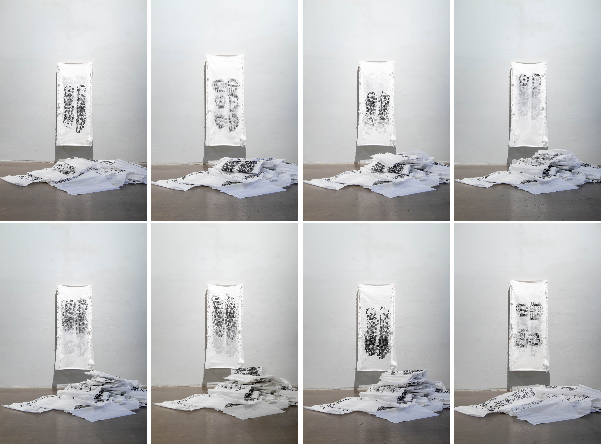
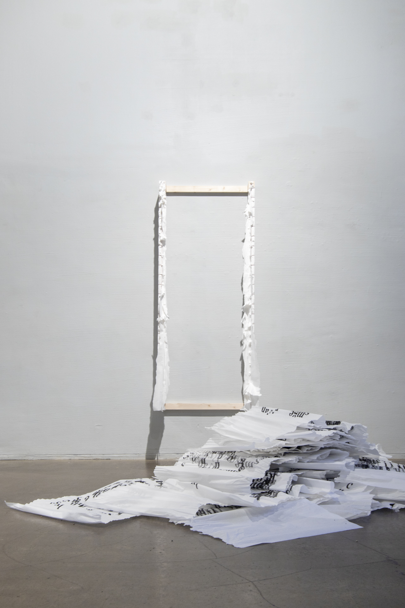
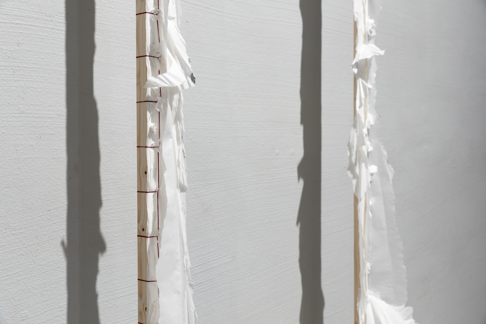
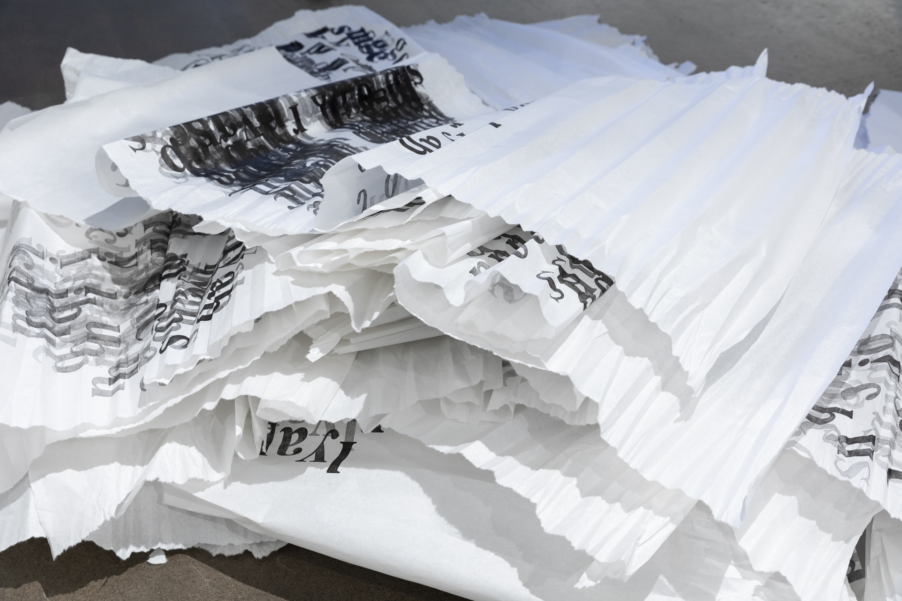

### **Lunisolar Calendar**

2022-2023, Performance, Letterpress print on 24 bound sheets of Chinese paper, 69 x 165 cm
 
In the work *Lunisolar Calendar*, Yujie Zhou used letterpress blocks of the Latin alphabet to form the shapes of the sun (日) and the moon (月) in Oracle Bone Script—an ancient form of Chinese writing. By repeatedly printing these characters using movable type and gradually increasing the number of impressions from one to twenty-four, the text progressively loses its legibility.

Starting on the first day of the exhibition, Zhou tore off one sheet of paper each day at the exhibition site.

Chinese, a character-based language, does not rely on an alphabet. However, it was Romanized to fit the QWERTY keyboard in a homogenizing effort, leading to the creation of Hanyu Pinyin—the most common input method for Mandarin today. When the characters 日 (sun) and 月 (moon) are combined, they form the character 明, which means "light," "tomorrow," and "understanding." The daily act of tearing off each sheet becomes a ritual gesture—an attempt to question and reflect on the meaning of language itself, as well as the implications of Romanization and linguistic erasure of language.

  

    

    

   

   

***Lunisolar Calendar***, Installation View at *MoA 23*, **Finnish Museum of Photography**, Finland, 2023
