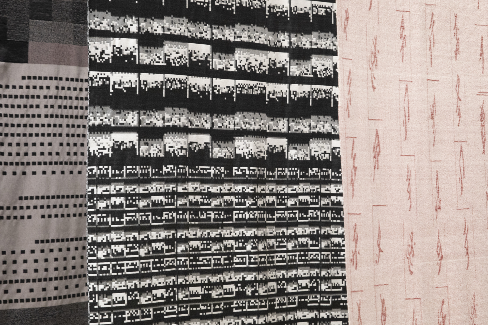
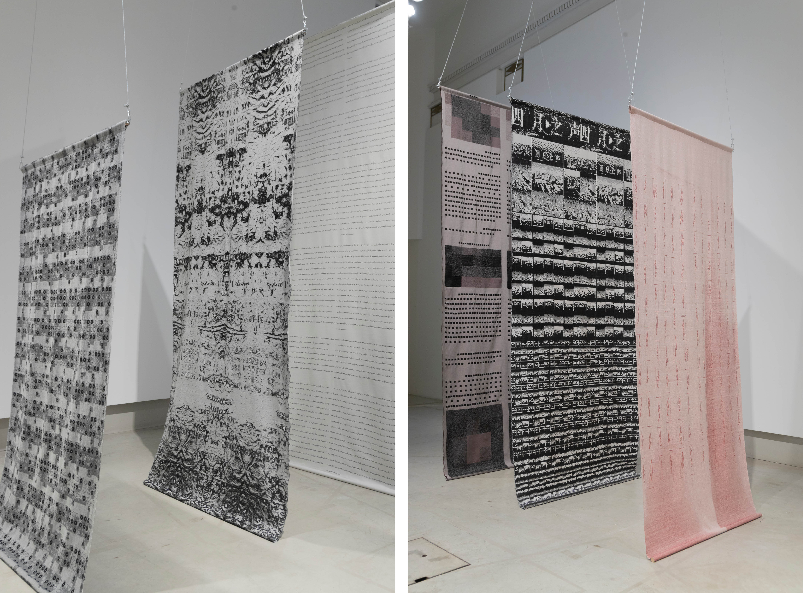
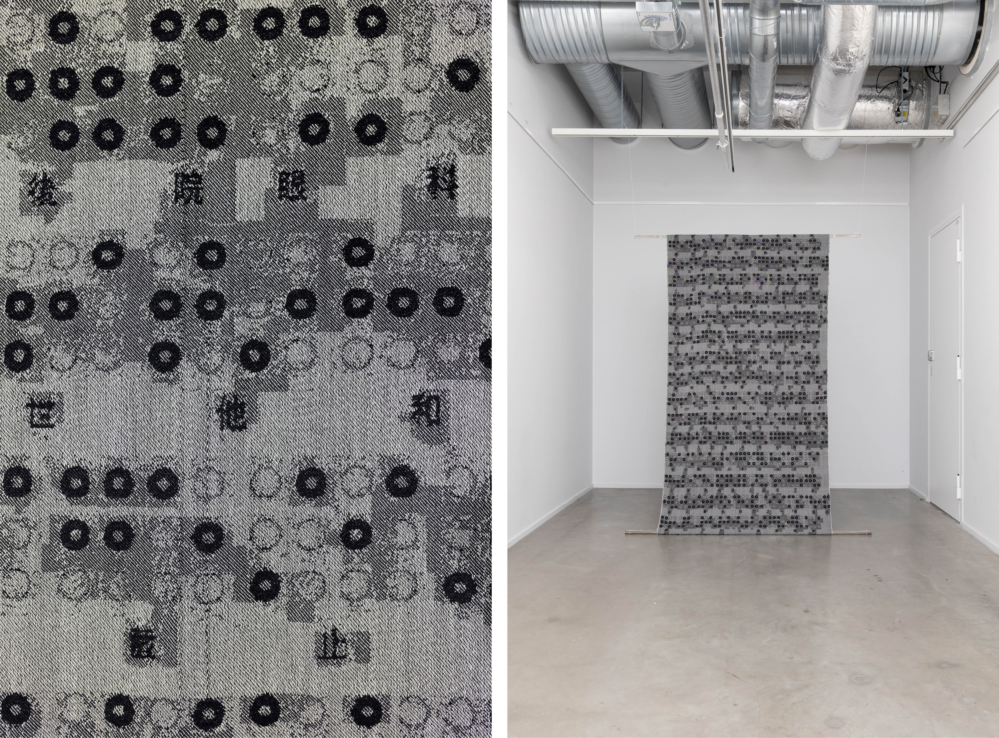
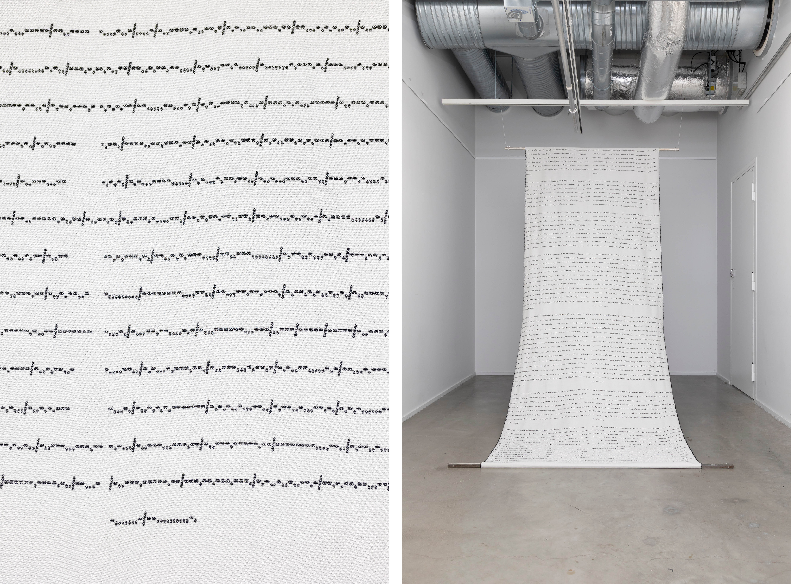
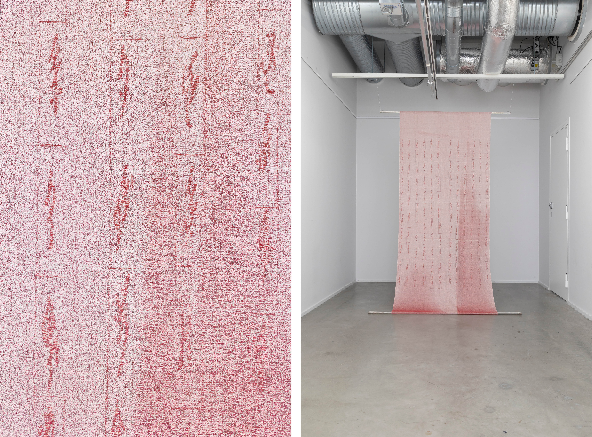

### **Save as Text**

from the series *Panoptic Segmentation*        
2023, Jacquard Weave, Wool and Cotton. Designed and woven by the artist, each work is a unique piece.

The word *text* finds its origins in Latin words such as *textum* (fiber), *textus* (fabric, material, or texture), and *texere* (weaving), establishing a profound connection to textile and weaving processes. *Save as Text* employs weaving as a form of writing. Inspired by various methods of translation used by anonymous netizens to make text illegible and evade censorship, weaving becomes a means for me to rewrite censored texts, giving them a new form that couldn't exist in their original written state.

In the ancient Chinese language –Oracle Bone Script, the word text (文, 'wén') was depicted as a person’s body with marks and drawings on it, symbolizing the act of writing and carving on the body itself. Involving significant physical labor and repetition of body movement during the weaving process, *Save as Text* also serves as a healing process for me, allowing the generation of new body memories that symbolize remembrance, resistance, and the refusal to forget.

  
***Save as Text***, Installation View at *QWERTY*, Solo Exhibition at **Photographic Gallery Hippolyte**, Finland, 2023

&nbsp;

  
***Save as Text***, Installation View at *QWERTY*, Solo Exhibition at **Photographic Gallery Hippolyte**, Finland, 2023

&nbsp;

 
***Save as Text***, Installation View at *QWERTY*, Solo Exhibition at **Photographic Gallery Hippolyte**, Finland, 2023

&nbsp;

  
***Save as Text***, Installation View at *QWERTY*, Solo Exhibition at **Photographic Gallery Hippolyte**, Finland, 2023

&nbsp;

  
 **Save as Text — The Whistle-Giver in Braille**            
2023, Jacquard Weave, Handwoven, Wool and Cotton, 210 x 110 cm.

 
&nbsp;

  
**Save as Text —The Whistle-Giver in Oracle Bone Script**            
2023, Jacquard Weave, Wool and Cotton, 260 x 110 cm.

 
&nbsp;

  

  
**Save as Text — The Whistle-Giver in Morse Code**            
2023, Jacquard Weave, Wool and Cotton, 310 x 110 cm.

 
&nbsp;

  

  
**Save as Text — 'A Letter from Tehran'in Nüshu (women's script) **            
2023, Jacquard Weave, Handwoven, Wool and Cotton, 240 x 110 cm.

 
&nbsp;

  

  
**Save as Text — Voice of April **            
2023, Jacquard Weave, Wool and Cotton, 280 x 110 cm.

 
&nbsp;

  

  
**Save as Text — In the End, We Lost Our Language **            
2023, Jacquard Weave, Wool and Cotton, 310 x 110 cm.
