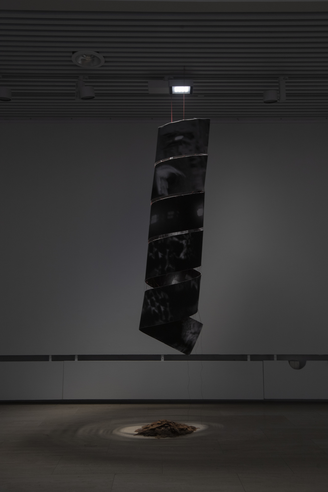
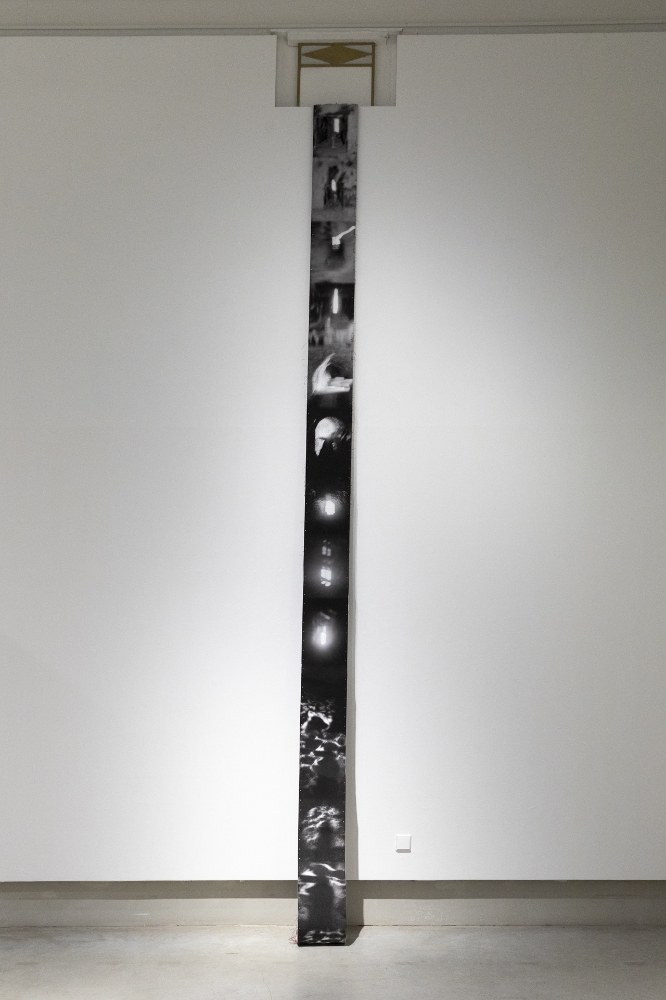
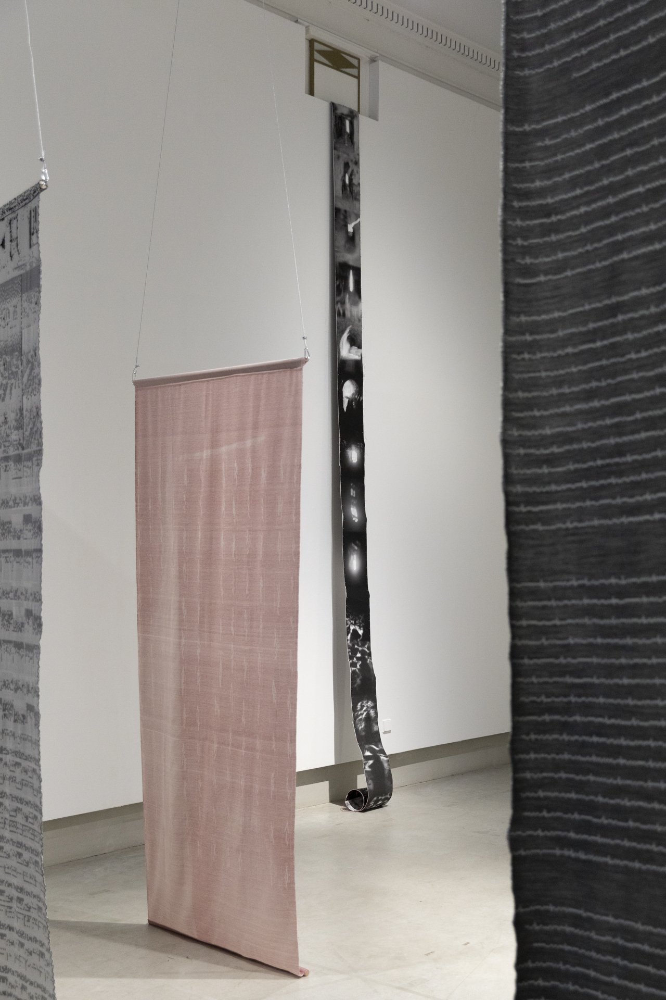
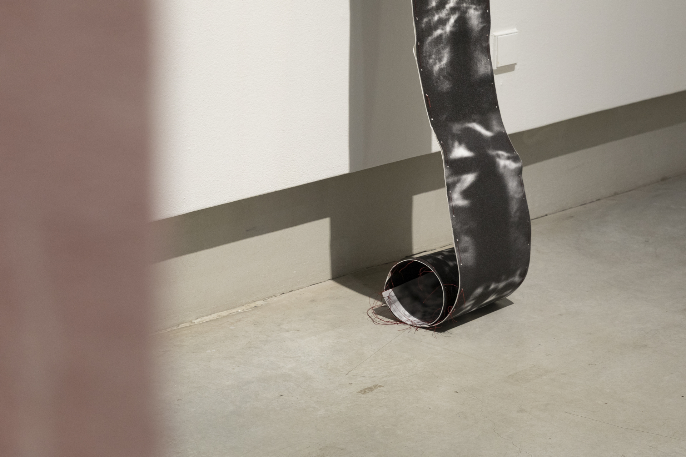

### **Shadow Theater**

from the series *Panoptic Segmentation*  
2022-2023, Archival Pigment Print, Not Framed, Hand-Stitched and Double-Sided, 525 x 25cm.

Plato’s cave symbolizes our confined living environment, where only the projected shadows of truth are visible. Shadow theater, on the other hand, shares similarities with Plato’s cave, primarily showcasing shadows. However, Chinese Shadow Theater distinguishes itself through its dual perspective on shadows – the audience observes the shadows projected onto the screen, while the performers themselves also see the shadows from behind the screen. In the Chinese context, I perceive Plato's cave as a tunnel with dual perspectives, drawing a connection to VPN (Virtual Private Network) – interconnected tunnels within a shared host network that form VPN connections.

In *Shadow Theater,* I traversed a physical tunnel rather than a virtual VPN tunnel, choosing to explore my own shadow. Photographs of the shadows captured during the tunnel performance were combined to create a continuous scroll, employing the dimensions of the most renowned Chinese handscroll painting– Along the River During the Qingming Festival, measuring 525 x 25 cm. This painting portrays the daily life of people in the capital city of China during the years 1805-1145, celebrating the bustling street scenes and festive atmosphere of the Qingming Festival. In my shadow theater, I aim to use the lens to focus on contemporary lives as we navigate through tunnels.

  
***Shadow Theater***, Installation View at *Tides*, **Espoo Culture Center**, Finland, 2023   

&nbsp;

  
***Shadow Theater***, Installation View at *QWERTY*, Solo Exhibition at **Photographic Gallery Hippolyte**, Finland, 2023

&nbsp;

  
***Shadow Theater***, Installation View at *QWERTY*, Solo Exhibition at **Photographic Gallery Hippolyte**, Finland, 2023

&nbsp;

  
***Shadow Theater***, Installation View at *QWERTY*, Solo Exhibition at **Photographic Gallery Hippolyte**, Finland, 2023

  