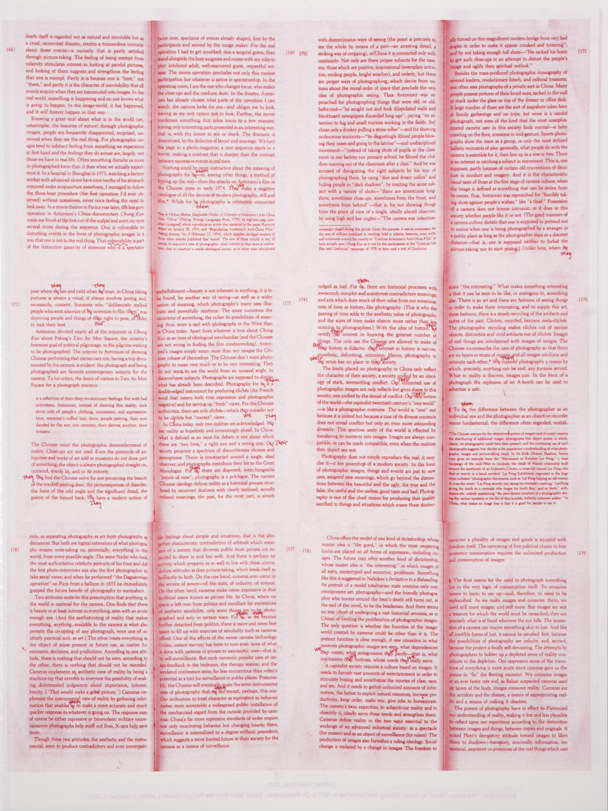
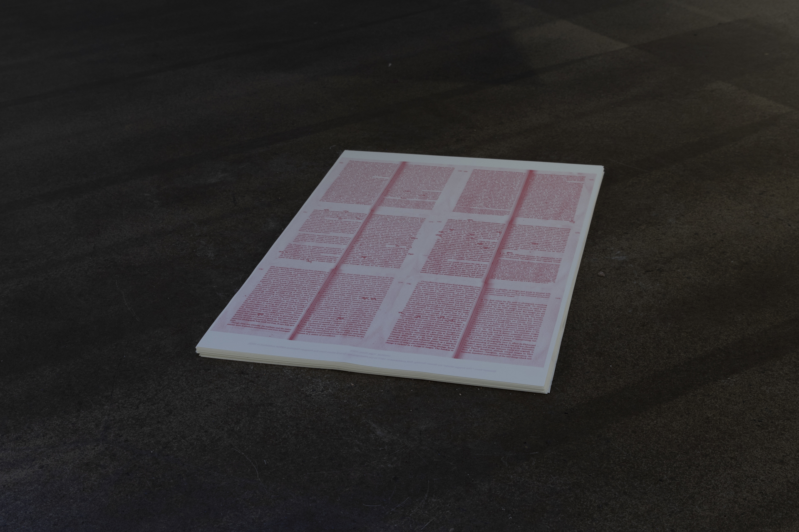

### **Us and Them**
from the series *Panoptic Segmentation*  
2023, Self-Published Poster, edition of 150       
Riso print, 59.4 x 42 cm. 

In *The Image World*, Susan Sontag differentiates Chinese and Western photography under a rather aleatory range of nuances. When discussing Western photography in her essay, she employed the pronouns *we*, *us*, and *our*; and, subsequently, when referring to Chinese photography, the pronouns *they*, *them*, and *their*. I realized that, under her written voice, I was one of *them*; I was repeatedly sentenced to not belong. The truth is, at times, possibly more often than I myself realize, I feel closer to that which she refers to as an *us*, than I do to her *them*. Maybe it would be more accurate to say I feel I exist between those categorizations, those of *us* and *them*. I grabbed my edition of *On Photography*, and scribbled on top of the pronouns employed in her referring to China with those she used for the West.

  
***Us and Them***, 2023

&nbsp;

  
***Us and Them***, Installation View at *MoA 23*, **Finnish Museum of Photography**, Finland, 2023