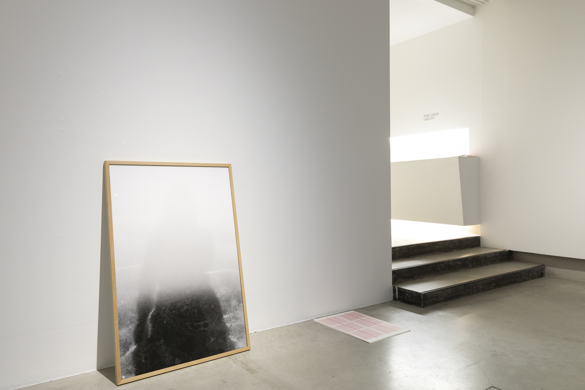

## Panoptic Segmentation
2022-2024, Medium: Photography, video, performance, publishing, and installation. 

Panoptic Segmentation refers to an image segmentation method in computer vision that allows machines to separate objects into segments. From a socio-political perspective, this method draws a parallel with the panopticon, a disciplinary mechanism based on continuous surveillance. Both systems operate similarly by breaking down objects into segmented components.

From a self-reflective critical stance, my practice seeks to identify, unravel and decode the mechanics behind power structures in order to tackle the invisible. I am eager to question the relationship between a collective political identity and our experiences as individuals. All with the purpose of deconstructing the notion of language so as to tear apart signifiers and reconstruct meaning.

&nbsp;

***1989 in Translation***, 
2022, Single-channel video, color, sound, 4:28 minutes  

&nbsp;

***Eye Exercises***, 2024, Single-Channel Video, Color, Sound, 5:50 minutes.

&nbsp;

***π***, 2023, Self-Published Artist book, Handmade, Edition of 25, Riso print, 143 x 81 x 12 mm.

&nbsp;

***Us and Them***, 2023, Self-Published Poster, edition of 150, Riso print, 59.4 x 42 cm. 

&nbsp;

***Eclipse***, 2022, Archival pigment print, 120 x 80 cm.  

&nbsp;

***Lunisolor Calendar***,  2022-2023, Performance, Letterpress print on 24 bound sheets of Chinese paper, 69 x 165 cm.

&nbsp;

***Ladder and Wall***,  2022, Ceramics, 65 x 45 x15 cm.

&nbsp;

