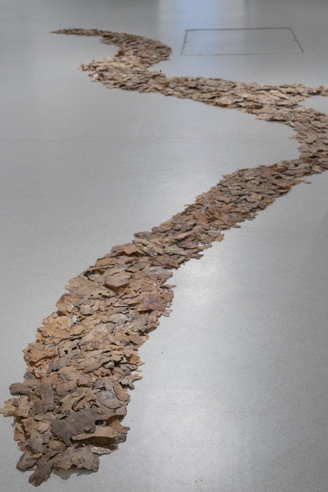
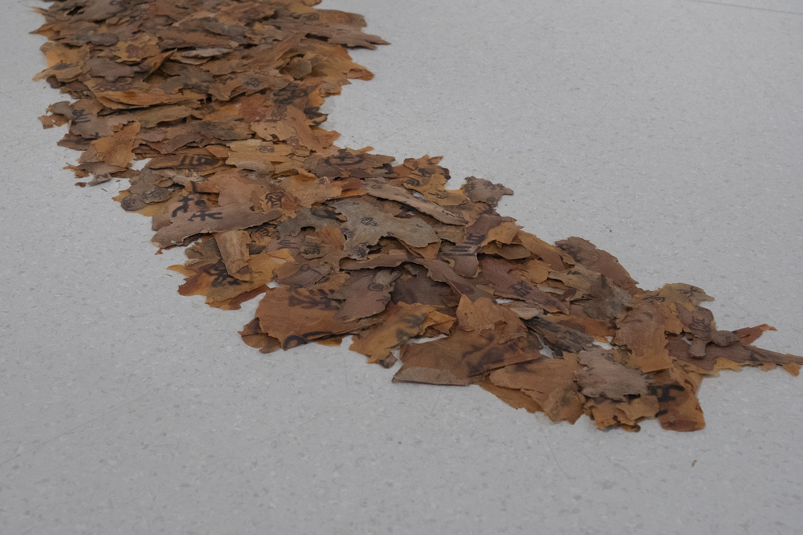
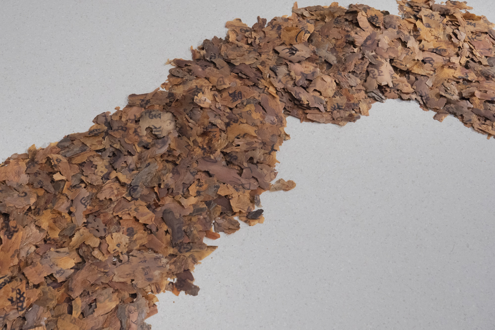

### **Yellow River**

from the series *Panoptic Segmentation*      
2023-2024, Site-specific installation, Sublimation print on barks.

In Finland, I noticed fallen pine bark scattered along the paths. The shapes of the bark reminded me of oracle bones—ancient Chinese writing engraved on them, which similarly has survived in fragments. Originally, there was no alphabet in Chinese; it was a pictorial language, like the oracle bone script. I began collecting bark during my walks in the forest, and over time, it accumulated.

Bark became a fragmentary writing material. I started to translate censored text I gathered from Chinese social media back into
the Oracle bone script and printed the text on each piece of bark
I collected during my walks in Finland over the past few years. I hope that in this form, there is still some partial remembrance of what is impossible to express.

   

   

   

   

   