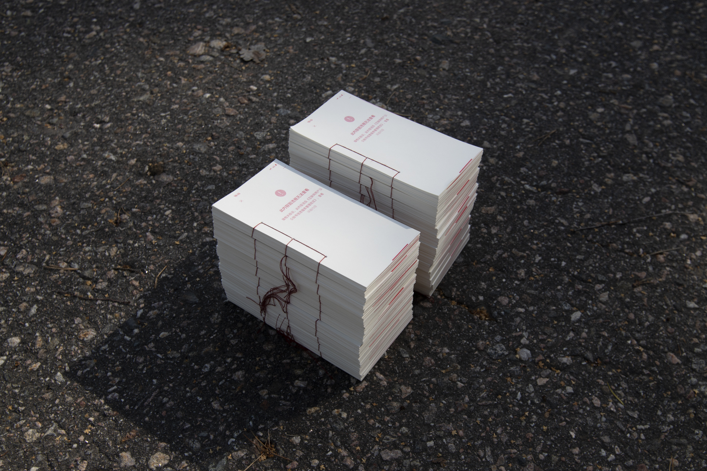
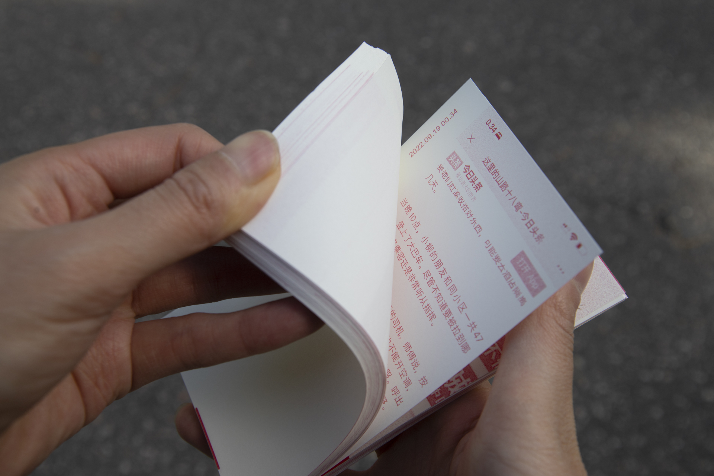
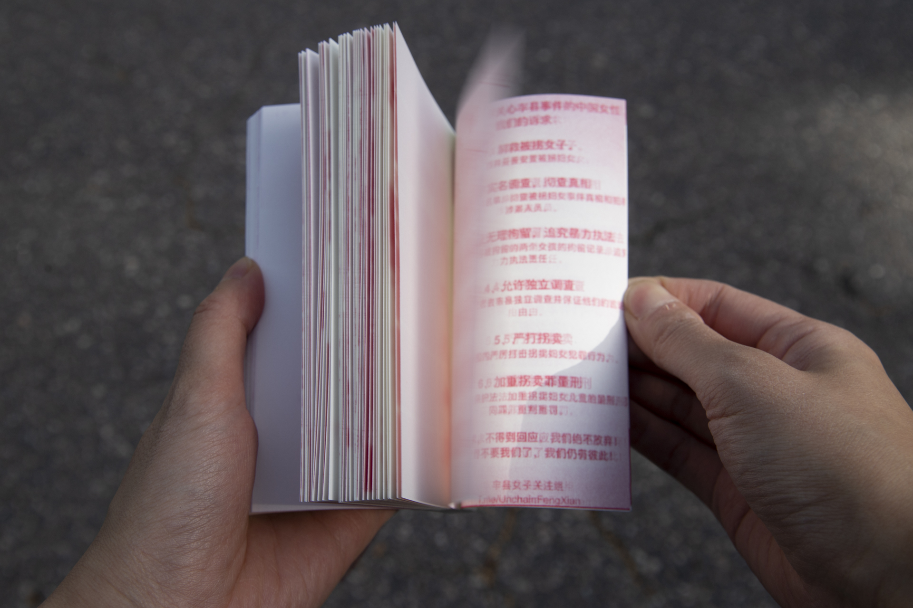
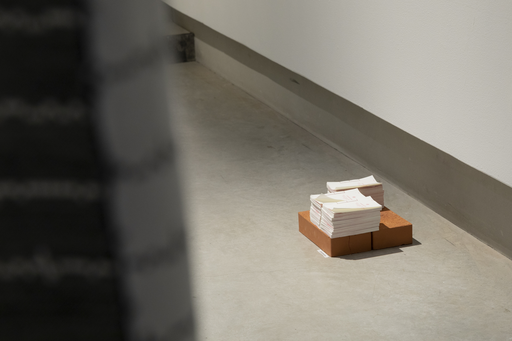

### **π**
from the series *Panoptic Segmentation*     
2023, Self-Published Artist book, Handmade, Edition of 25.
Riso print, 143 x 81 x 12 mm.

The flip book compiles screenshots, from my personal image reel; it makes them public in a gesture that resists the fleeting nature of sensitive content when within an internet-based media environment. It takes the form of a seamless narrative, that accounts for multiple readings. Having endured severe oppression throughout my life, I developed an ability to intuit when content is prone to be censored. These screenshots are fragments, information records that may otherwise be blocked and disappear. Part of a silent wide-spread communal resistance, these screenshots belong to everyone; they strive to become collective memory, denounce a collective amnesia.

In the book, the traditional Japanese binding stitching was altered as to have open edges; this makes it possible to read *π* from different directions. Directionality in *π* translates as dimensionality, where different planes add depth to the information showcased. Vertically, a continuous flow of screenshots proves hard to decode; horizontally, a passage of time sheds light into a historically informed understanding of events. Akin to the periodical nature of the mathematical constant π, the book suggests a kind of circularity; it fosters a continuous cycle that aims to convey unity and fraternity among us.



***π***, Documentation video.

  

  

  

***π***,  2023.

&nbsp;

 
***π***, Installation View at *QWERTY*, Solo Exhibition at **Photographic Gallery Hippolyte**, Finland, 2023

  
