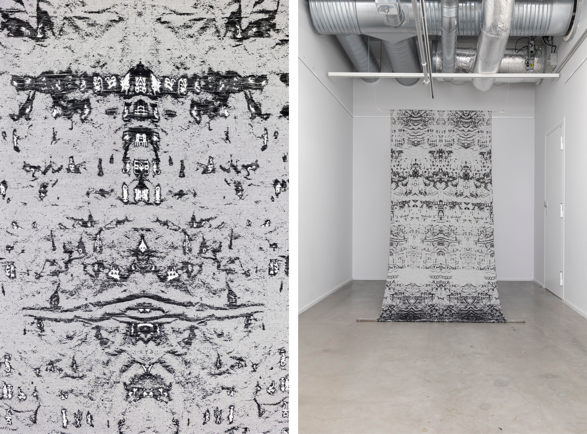
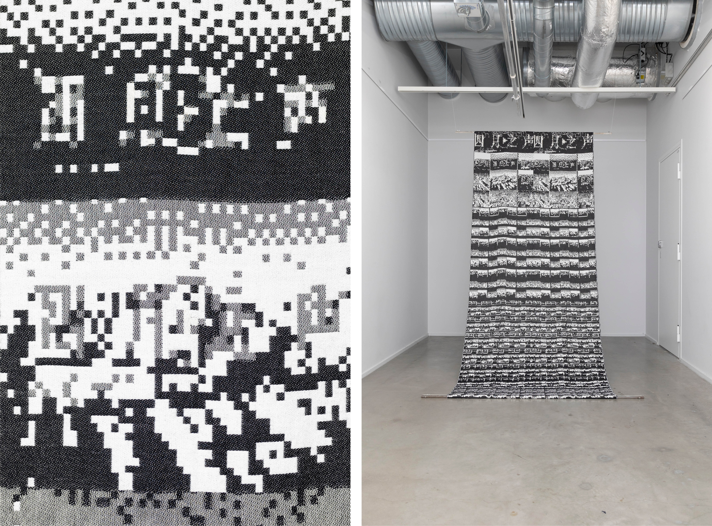
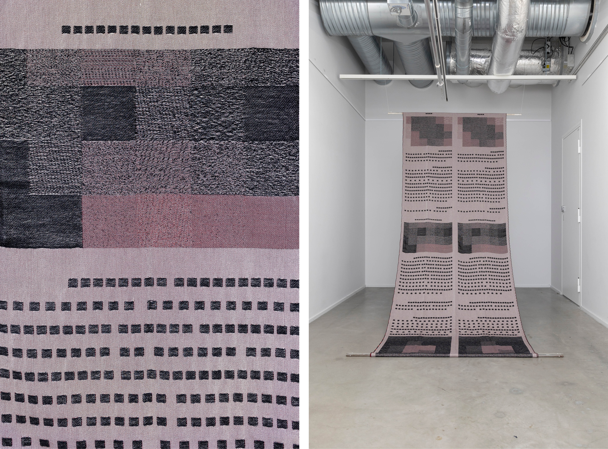

### **Save as Text**

   
2023-ongoing     
Jacquard Weave, Wool and Cotton. Designed and woven by the artist, each work is a unique piece.

***Save as Text*** employs weaving as a form of writing to circumnavigate censorship in the contemporary era. Inspired by creative translation methods used by anonymous netizens on social media to evade censorship while dismantling propaganda, weaving is the artist’s medium to rewrite censored texts. By utilizing glitches in photography and the image-making process, this medium disrupts and preserves the censored texts as a new form of evidence that cannot exist in their original state.

In ancient Chinese language, the character for text （文）originated as the literal depiction of a tattooed human body.  Paralleling the permanence of tattoos, the Jacquard Weave materializes the ephemeral nature of social media content into tangible, long-lasting forms. Though many present-day whistleblowers have “disappeared” along with their digital footprint, *Save as Text* memorializes their impact and bravery, continuing on their legacy for sharing truth.

  

  

 

  
***Save as Text***, Installation View at *QWERTY*, Solo Exhibition at [**Photographic Gallery Hippolyte**](https://hippolyte.fi/en/nayttely/yujie-zhou/), Helsinki, Finland, 2023

&nbsp;

  
 **Save as Text — The Whistle-Giver in Braille**            
2023, Jacquard Weave, Handwoven, Wool and Cotton, 210 x 110 cm.

 
&nbsp;

  
**Save as Text —The Whistle-Giver in Oracle Bone Script**            
2023, Jacquard Weave, Wool and Cotton, 260 x 110 cm.

 
&nbsp;

  

  
**Save as Text — The Whistle-Giver in Morse Code**            
2023, Jacquard Weave, Wool and Cotton, 310 x 110 cm.

 
&nbsp;

  

  
**Save as Text — 'A Letter from Tehran'in Nüshu (women's script) **            
2023, Jacquard Weave, Handwoven, Wool and Cotton, 240 x 110 cm.

 
&nbsp;

  

  
**Save as Text — Voice of April **            
2023, Jacquard Weave, Wool and Cotton, 280 x 110 cm.

 
&nbsp;

  

  
**Save as Text — In the End, We Lost Our Language **            
2023, Jacquard Weave, Wool and Cotton, 310 x 110 cm.
