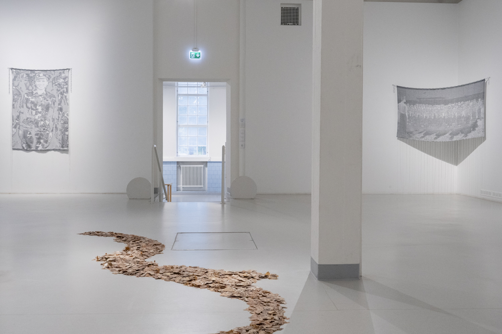
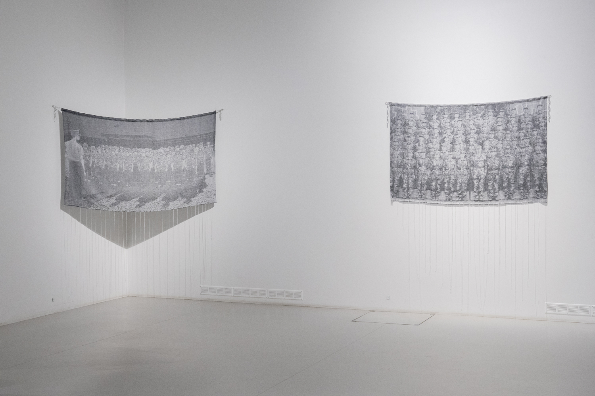
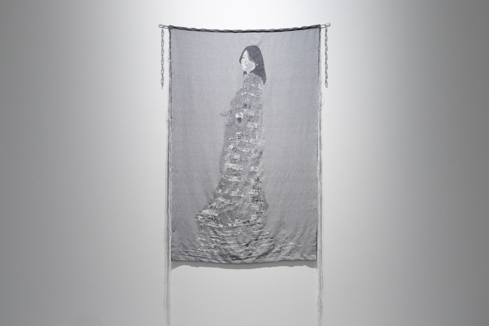
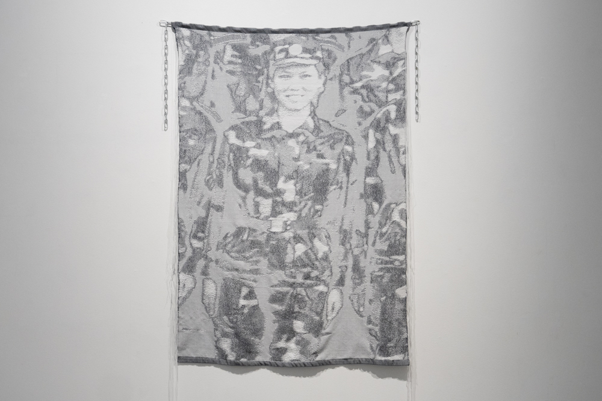

### **White Shadows**

   
2024-ongoing     
Jacquard Weave, Handwoven, Wool and Cotton. Designed and woven by the artist, each work is a unique piece.

***White Shadows*** is a series of handwoven textile works created using the Jacquard weaving technique. These tapestries transform archival images from the artist's upbringing—scenes marked by propaganda events and disciplinary practices—into black-and-white pixelated structures. The pixels function both as intersections of warp and weft in weaving and as the basic units of photography. The white pixels in the woven structures are intended to bring the white weft threads to the front of the textiles. In this way, Zhou makes the silenced and normalized experience visible— creating “white shadows.”

Glitches occur as the pixels are translated from image files to weaving design files, forming the woven structure —faces blur, recognition fades, and identities are obscured. These deliberate disruptions act as a form of camouflage, protecting the artist and others who share this collective identity. Through these works, the artist seeks to reclaim agency over their experience and narrative, transforming what once symbolized uniformity into something deeply personal and reflective.

  

  

  

     

     

***White Shadows***, Installation View at *White Shadows*, Solo Exhibition at [**Taidekeskus Mältinranta**](https://maltinranta.fi/yujie-zhou/), Tampere, Finland, 2024     

&nbsp;

  
  
 
**My Current Other Self **            
2024, 165 x 105 cm, Jacquard Weave, Handwoven, Wool and Cotton. 

 
&nbsp;

     
**Close-up of Myself Standing for a Group Photo at Military Training **            
2024,  155 x 105 cm, Jacquard Weave, Handwoven, Wool and Cotton. 
 
&nbsp;

      
**Military Training **            
2024, 105 x 165 cm, Jacquard Weave, Handwoven, Wool and Cotton. 

 
&nbsp;

    
**Group Exercise **            
2024, 105 x 175 cm, Jacquard Weave, Handwoven, Wool and Cotton. 

 
&nbsp;

   
**Group Photo at Military Training **            
2024, 105 x 150 cm, Jacquard Weave, Handwoven, Wool and Cotton. 

 
&nbsp;

       
**Singing Under Flag **            
2024, 105 x 150 cm, Jacquard Weave, Handwoven, Wool and Cotton. 

 
&nbsp;

          
**Sports Event**            
2024, 105 x 175 cm, Jacquard Weave, Handwoven, Wool and Cotton. 

 
&nbsp;

        
**Singing Together**            
2024, 105 x 105 cm, Jacquard Weave, Handwoven, Wool and Cotton. 

 
&nbsp;
